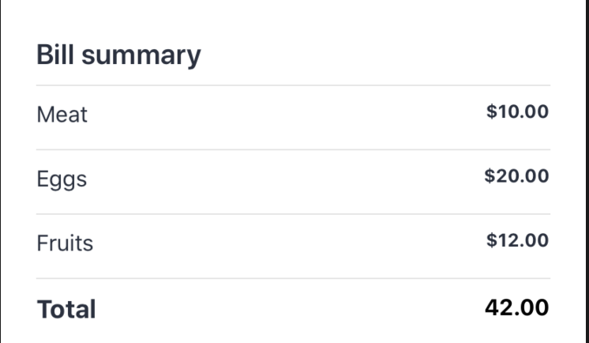

# react-native-components
[NPM Package](https://www.npmjs.com/package/react-native-components)

A set of easy and highly customizable React Native components

## Getting started

- `yarn add react-native-components`
- `npm install react-native-components`

### Usage

# Components

## SummaryItems

It allows you to create a highly customizable and dynamic summary of items.

</img>

### Usage

`import { SummaryItems } from 'react-native-components';`

```jsx
<SummaryItems
  containerStyle={{ marginHorizontal: 25 }}
  titleStyle={{ fontSize: 20 }}
  itemContainerStyle={{}}
  itemTitleStyle={{ fontSize: 16 }}
  itemValueStyle={{ fontWeight: 'bold' }}
  totalContainerStyle={{}}
  totalTitleStyle={{ fontSize: 18, fontWeight: 'bold' }}
  totalValueStyle={{ fontSize: 16, fontWeight: 'bold' }}
  title="Bill summary"
  items={[
    {
      title: 'Meat',
      value: '$10.00',
    },
    {
      title: 'Eggs',
      value: '$20.00',
    },
    {
      title: 'Fruits',
      value: '$12.00',
    },
  ]}
  total={{
    title: 'Total',
    value: '42.00',
  }}
/>
```

### License

This project is licensed under the MIT License - see the [LICENSE](LICENSE) file for details.
